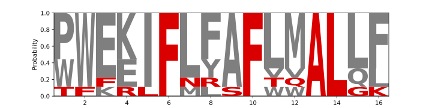

# Sequence Logos



### Usage

Takes input sequences from text file: 

```
TFFRLFNRSFTQALGK
PWEKIFLYAFVVALQL
PWEKIFLFAFLMALLF
PWEKIFLFAFLMALLF
...
PWEKIFLFAFLMALLF
PWEKIFLFAFLMALLF
WWEEIFMYAFLMALLF
WWKEIFLFAFLMALLF
```

```
$ ./main.py -h

usage: main.py [-h] [--input INPUT]

options:
  -h, --help         show this help message and exit
  --input, -i INPUT  Input file path
```

### Dependencies: 
- pandas
- matplotlib
- logomaker https://github.com/jbkinney/logomaker

Use conda environment from `environment.yml`:

```
conda env create -f environment.yml
conda activate seqlogo
```
